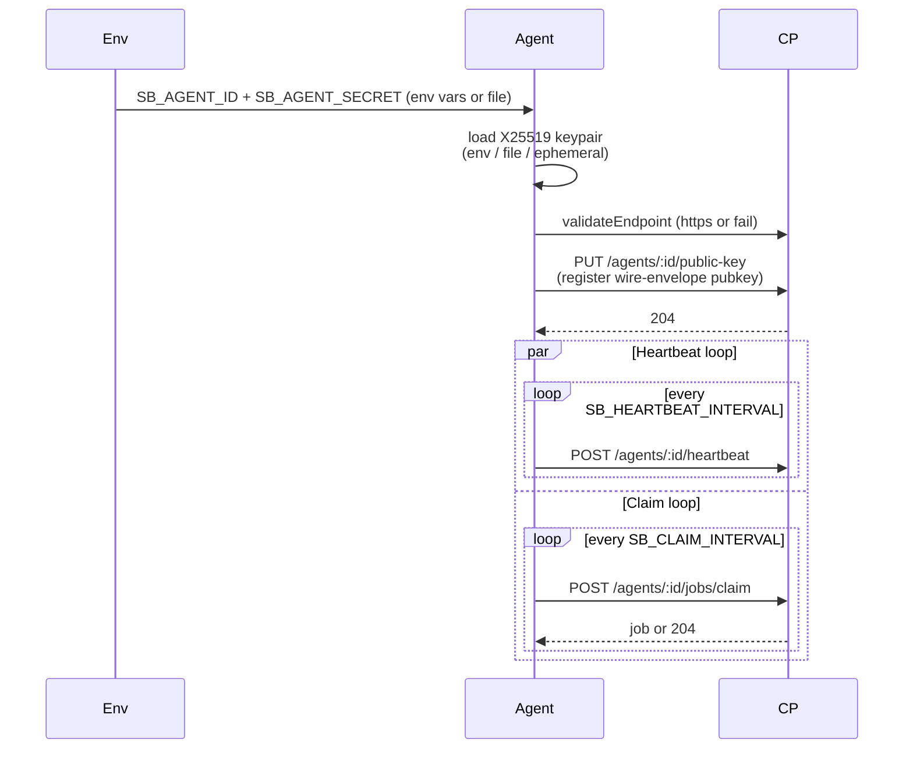

# Agent

Repo: [`secrets-bridge/agent`](https://github.com/secrets-bridge/agent)
· Stack: Go 1.25 stdlib `net/http` (no Fiber) +
[hashicorp/vault/api](https://github.com/hashicorp/vault) +
[aws-sdk-go-v2/service/secretsmanager](https://github.com/aws/aws-sdk-go-v2)
· Container: `golang:1.25-alpine` → `distroless/static:nonroot`

The execution tier. Runs inside the target account / cluster.
Holds provider credentials for its own boundary only; the Control
Plane never sees them.

## Hard rules — enforced by CI

| Rule | How |
|---|---|
| No database driver | CI greps `go.sum` for `pgx`, `lib/pq`, `mysql`, `mongo-driver`; fails on hit |
| No Redis client | CI greps `go.sum` for `redis/go-redis`, `gomodule/redigo`; fails on hit |
| No inbound public listener | `SB_LOCAL_ADDR` defaults to `127.0.0.1:8090` (loopback only — for probes) |
| Identity file mode 0600 | `TestSaveToFile_AtomicNoPartialOnFailure` asserts the perm bits |
| TLS required to the CP | `validateEndpoint` refuses `http://` unless `SB_INSECURE_TRANSPORT=true` |
| Plaintext zeroed after one use | `client.Zero([]byte)` is called via `defer` on every value-bearing slice |

## Boot sequence

## Configuration

| Env var | Required | Default | Notes |
|---|---|---|---|
| `SB_CP_ENDPOINT` | yes | — | `https://api.secrets-bridge.example` |
| `SB_AGENT_ID` | yes | — | UUID from `POST /agents` |
| `SB_AGENT_SECRET` | yes | — | Returned once at mint |
| `SB_CLUSTER_NAME` | yes for discovery jobs | — | Stamped on every discovered secret |
| `SB_HEARTBEAT_INTERVAL` | no | `30s` | Bounded by api's stale-after window |
| `SB_CLAIM_INTERVAL` | no | `5s` | Claim cadence |
| `SB_CLAIM_CONCURRENCY` | no | `4` | Worker pool size; non-blocking semaphore |
| `SB_INSECURE_TRANSPORT` | no | `false` | Set true ONLY for local-dev `http://` |
| `SB_CP_CA_FILE` | no | — | Pin a private CA (replaces system roots) |
| `SB_AGENT_PRIVATE_KEY_FILE` | no | ephemeral | X25519 keypair persistence |
| **Provider creds** (per resolver) | yes | — | See [Providers supported](../reference/providers.md) |

## Executors that ship today

| Job type | Executor | What it does |
|---|---|---|
| `patch` | `PatchExecutor` | Fetches wraps → `GetValue` (existing bundle) → merge → `PutValue` → mark consumed. Idempotent re-runs (untouched keys survive). |
| `read` | `ReadExecutor` | Fetches one bundle → selective `target_keys` split → `POST /agents/:id/wraps` per key → zero plaintext after each post |
| `discover` | `DiscoverExecutor` | `ListMetadata(scope)` → preserve native tags verbatim into the CP's `labels` jsonb (Vault `custom_metadata`, AWS Tags, etc.) |

## Provider resolvers

The agent dispatches by `payload.target_provider_type` via
`ResolverByType`. Today:

| Type | Status | Auth |
|---|---|---|
| `vault` | ✅ ships | Token (`SB_VAULT_TOKEN`) or Kubernetes (`SB_VAULT_KUBERNETES_ROLE`) |
| `aws-sm` | ✅ ships | Standard AWS SDK chain (IRSA / instance role / `AWS_*` env) |
| `gcp-sm` | placeholder | Stub returns `NotConfiguredResolver` |
| `azure-kv` | placeholder | Stub returns `NotConfiguredResolver` |

Every resolver refuses credential-shaped keys in the
`target_provider_config` (e.g. `awsSecretAccessKey`, `token`,
`sessionToken`) so a future api bug can't accidentally ship a
credential to the agent over the wire.
