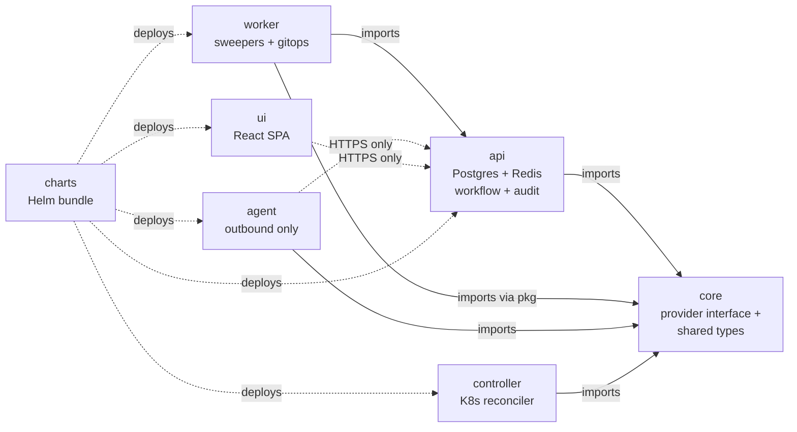

# Components

The project is split into eight repositories under the
[`secrets-bridge`](https://github.com/secrets-bridge) GitHub
organisation. Each one has a single responsibility; the dependency
direction is one-way and reviewable.

| Repo | Language | Holds |
|---|---|---|
| [`core`](core.md) | Go | Provider interface + connectors, shared types. **Infra-free: no Postgres, no Redis.** |
| [`api`](api.md) | Go (Fiber v3) | Control Plane API. Owns Postgres + Redis + the workflow/RBAC domain. |
| [`worker`](worker.md) | Go | Background sweepers, the GitOps observation poller, periodic discovery scheduler. |
| [`agent`](agent.md) | Go | Outbound-only execution agent. **No Postgres / Redis dependency.** |
| [`controller`](controller.md) | Go (kubebuilder) | Kubernetes CRD reconciler. Receives the v0.1.0 operator. |
| [`ui`](ui.md) | React + TS + Vite | SPA dashboard. No SSR. |
| `charts` | Helm / YAML | Deploy manifests for all components (in progress). |
| `docs` | mkdocs-material | This site. |

## Dependency graph

The forbidden edges:

- `agent` → `api/internal/storage` (would pull Postgres into the
  workload network)
- `agent` → `api/internal/runtime` (would pull Redis)
- `controller` → `api/pkg/storage` (same reasoning)
- `core` → anything that imports `database/sql` / `redis/*`

CI in each repo greps `go.sum` to enforce these directions; the
build fails if a forbidden module path appears.
