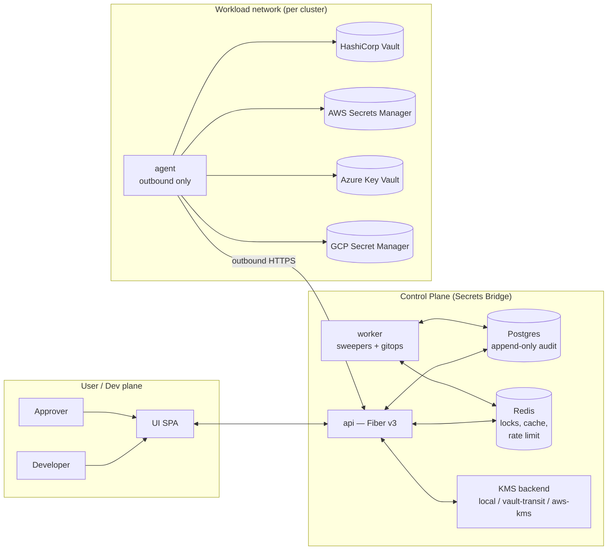

# Architecture

The platform splits into three loosely-coupled tiers and one
metadata index. Each tier holds one type of trust: the Control
Plane decides; the Agent executes; the Providers own the values.



## Trust boundaries — what holds what

| Component | What it holds | What it must never hold |
|---|---|---|
| **UI** | A short-lived JWT in React state | Any provider credential, any plaintext value beyond the reveal-once modal lifetime |
| **API** | KMS-wrapped envelopes (single-shot, TTL'd), audit rows, policy rules, role catalogs | Raw plaintext values, provider master credentials |
| **Postgres** | Hashes + envelopes + metadata + append-only audit | The decryption key — that lives in the KMS backend, *outside* Postgres |
| **Redis** | Idempotency tokens, distributed locks, rate-limit windows, pub/sub messages | Any value-bearing payload (the `runtime` package doesn't even expose a generic `Set()` ) |
| **Worker** | The same Postgres + Redis access as the API | Provider credentials, plaintext values |
| **Agent** | Provider credentials *for its own network boundary*, plaintext values for the duration of one request | Anything from another cluster / account; no inbound listener; no Postgres / Redis client |
| **Providers** | The actual secret values | n/a — these are unchanged systems |

## The four request lifecycles

=== "Read"

    ```mermaid
    sequenceDiagram
        participant Dev
        participant UI
        participant API
        participant Approver
        participant Agent
        participant Vault

        Dev->>UI: Submit read request<br/>(prod/db/password, justification)
        UI->>API: POST /requests/read
        API->>API: Resolve policy → workflow
        API-->>UI: status: pending
        Approver->>UI: Click Approve
        UI->>API: POST /requests/:id/approve
        API->>API: Enqueue read job
        API-->>UI: status: approved
        Agent->>API: POST /jobs/claim
        API-->>Agent: read job payload
        Agent->>Vault: GetValue prod/db/password
        Vault-->>Agent: bundle with DB_PASSWORD
        Agent->>API: POST /agents/:id/wraps<br/>(envelope-encrypted)
        Agent->>API: POST /jobs/:id/complete (succeeded)
        API-->>Agent: 204
        Dev->>UI: Click Reveal (one-time)
        UI->>API: GET /requests/:id/wraps/:wrap_id<br/>?user_id=dev
        API->>API: Atomic consume + KMS decrypt
        API-->>UI: plaintext (base64, single-shot)
        UI->>UI: Show in modal, clear on close
    ```

=== "Patch"

    ```mermaid
    sequenceDiagram
        participant Dev
        participant UI
        participant API
        participant Approver
        participant Agent
        participant Vault

        Dev->>UI: Submit patch request<br/>prod/db/password = new-value
        UI->>API: POST /requests with key_values
        API->>API: KMS-wrap each value;<br/>resolve policy → workflow
        API-->>UI: status: pending
        Approver->>UI: Approve
        UI->>API: POST /requests/:id/approve
        API->>API: Enqueue patch job
        Agent->>API: POST /jobs/claim
        API-->>Agent: patch job +<br/>list of wrap ids
        loop For each wrap
            Agent->>API: GET /agents/:id/wraps/:wrap_id
            API->>API: KMS-decrypt + single-shot consume
            API-->>Agent: plaintext (envelope-sealed if<br/>agent has registered pubkey)
        end
        Agent->>Vault: GetValue(prod/db/password)
        Vault-->>Agent: existing bundle
        Agent->>Vault: PutValue (merged bundle)
        Agent->>API: POST /jobs/:id/complete (succeeded)
        API-->>UI: status: executed
    ```

=== "Discovery"

    ```mermaid
    sequenceDiagram
        participant Admin
        participant API
        participant Agent
        participant Vault

        Admin->>API: POST /jobs job_type=discover
        Agent->>API: POST /jobs/claim
        API-->>Agent: discover job payload
        Agent->>Vault: ListMetadata(scope)
        Vault-->>Agent: 47 secrets with<br/>custom_metadata tags
        Agent->>API: POST /agents/:id/secrets/bulk<br/>cluster + provider + items
        API->>API: Upsert on cluster+provider+ref<br/>preserve first_seen_at<br/>refresh labels jsonb
        Agent->>API: POST /jobs/:id/complete (succeeded)
        Admin->>API: GET /secrets?label=Environment:prod<br/>&label=Team:billing
        API-->>Admin: filtered list (GIN index)
    ```

=== "GitOps observation"

    Off by default. Enable with `SB_GITOPS_ENABLED=true` on the api
    AND `SB_WORKER_GITOPS_ENABLED=true` on the worker.

    ```mermaid
    sequenceDiagram
        participant API
        participant Worker
        participant ArgoCD

        Note over API: Patch request transitions to executed
        API->>API: Fan out observations for every<br/>app mapping bound to this secret
        loop Every 15s
            Worker->>API: Claim next observation
            Worker->>ArgoCD: GET /api/v1/applications/:name/resource-tree<br/>read-only transport, no POST
            ArgoCD-->>Worker: app status (filtered)
            Worker->>API: Update observed_state
            alt Healthy AND Synced
                Worker->>API: Transition to applied
            else OperationPhase failed
                Worker->>API: Transition to failed
            else timeout_at reached
                Worker->>API: Transition to applied_unverified
            end
        end
    ```

## Defense-in-depth on the wire

Three layers of encryption protect every value-bearing flow:

```
TLS (mandatory)              — passive sniffers, compromised system CA
  ↓
Wire envelope (Piece 8b)     — TLS-terminating proxies, CP-side log leaks
  ↓
Storage envelope (Piece 8a)  — DB exfiltration, offline backup theft
```

| Direction | Wire envelope scheme |
|---|---|
| **CP → Agent** | X25519 ECDH + HKDF-SHA256 + AES-256-GCM, sealed to the agent's registered public key. Even a TLS-terminating gateway sees only ciphertext. |
| **Agent → CP** | CP issues a KMS-wrapped data-encryption key; agent uses it for AES-256-GCM and zeroes the plaintext DEK immediately. The CP unwraps via the KMS backend. |
| **At rest** | KMS-envelope: per-row data key, wrapped by the configured `KeyManager` (LocalKMS for dev, Vault Transit or AWS KMS for production). |

## Why polyrepo

Eight repositories, one product. The `core` library is infra-free —
no Postgres driver, no Redis client, no Fiber import — so the
`agent` and `controller` can depend on it without pulling in
storage. The `api` and `worker` share Postgres/Redis but the worker
imports `api/pkg/*` only (never `internal/*`), so the dependency
direction is one-way and reviewable.

CI in every repo greps `go.sum` to enforce these boundaries — for
example the agent's CI fails the build if it ever picks up
`jackc/pgx`, `lib/pq`, `redis/go-redis`, or similar drivers.

Read more: [REFACTOR_PLAN.md §4 polyrepo dependency graph](https://github.com/secrets-bridge/.github/blob/main/REFACTOR_PLAN.md).
