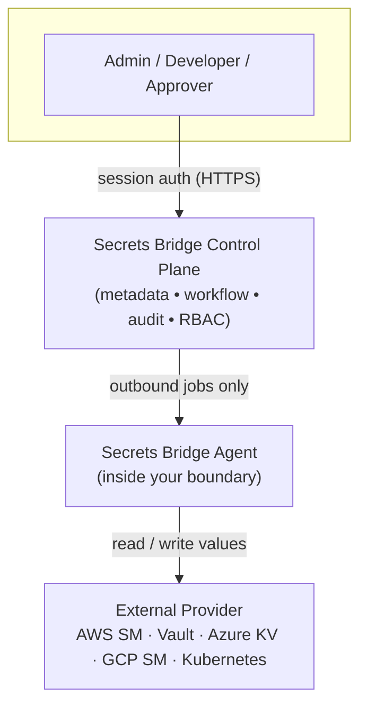

# Product status

Secrets Bridge is a working platform, not a slide deck. This page is the honest
map of what exists today, what has been QA-certified, what's actively being
built, and what's still on the roadmap. Nothing below is aspirational unless it
sits under **Roadmap**.

!!! info "What Secrets Bridge is"
    Secrets Bridge is a **unified secrets control plane** for governing secrets
    across external providers **without storing secret values in the control
    plane**.

    It **does not replace** HashiCorp Vault, AWS Secrets Manager, Azure Key
    Vault, GCP Secret Manager, or Kubernetes External Secrets. It governs
    **access, workflows, approvals, audit, and agent execution** around them —
    the values stay in your provider.

## Implemented features

Everything in this section is built and running.

| Feature | What it does |
|---|---|
| **Provider connections** | Manage external secret-provider connections and bind them to projects / environments. |
| **Agent onboarding** | Secure, outbound-only agent enrollment using **one-time enrollment tokens** and a **persistent agent identity** bound to one provider connection. |
| **Direct reveal** | Controlled non-prod secret reveal with **MFA step-up**, **TTL**, **single-shot wraps**, and a **server-anchored countdown**. |
| **Prod protection** | Direct reveal is **hard-blocked for prod** environments and the refusal is audited (metadata-only). |
| **Cross-team secret request flow** | Requester submits destination keys → value provider fills values → approver verifies → agent executes the provider write. |
| **Destination key enforcement** | Destination keys are validated at the **submit, fill, and execute** boundaries. |
| **Metadata-only audit trail** | Records actions, IDs, statuses, reasons, and timestamps — **never** plaintext values, tokens, or wrap bodies. |
| **Agent fleet visibility** | Admin / provider agent list, `provider_connection_id` binding, active / stale / revoked status, revoke flow, and heartbeat. |
| **Security model** | No secret values in Postgres, Redis, audit logs, browser storage, or control-plane logs. |

## QA-certified

The following flows have passed a focused QA cycle and are tracked as a
release / demo candidate. "PASS" means verified end-to-end, not merely merged.

| Certification | Status |
|---|---|
| Project access (RBAC + environment scoping) | ✅ PASS |
| Direct reveal end-to-end + TTL | ✅ PASS |
| Prod reveal refusal | ✅ PASS |
| Cross-team backend / API lifecycle | ✅ PASS |
| Cross-team UI drawer submit | ✅ PASS |
| Approver verify-panel context | ✅ PASS |
| Plaintext-leakage sweep | ✅ PASS |
| Agent Onboarding API | ✅ PASS / CLOSED |

## In progress

Being built now; not yet live or certified — do not depend on these yet.

- **Agent enrollment rollout** — the enrollment flow and its Helm packaging are
  built; rolling it onto a live agent is gated on a controlled rollout.
- **Richer agent fleet dashboard (UI)** — the agent management API exists; the
  full fleet UI view is next.

## Live vs Roadmap

### Live / implemented

- AWS Secrets Manager provider connection
- Outbound agent (execution inside your boundary)
- Direct reveal (non-prod, MFA-gated, single-shot)
- Cross-team request → fill → approve → execute workflow
- Metadata-only audit trail
- Provider-bound agent onboarding (one-time enrollment tokens)
- Agent revoke / list / status
- Non-prod reveal protection
- Prod reveal refusal (audited)

### Roadmap / coming later

*Listed here because they are **not** live yet — do not read these as shipped.*

- Azure Key Vault provider
- GCP Secret Manager provider
- HashiCorp Vault advanced flows
- Deeper Kubernetes External Secrets integration
- Flux integration
- Agent connection-scoped job claim
- Richer agent fleet dashboard

## Security model at a glance

- The **agent is outbound-only** — it opens connections to the control plane and
  to its local provider; it never accepts inbound connections.
- The agent **exposes no inbound ports** (health probes are loopback).
- The agent has **no Postgres and no Redis** dependency, and **no Kubernetes API
  access** to read or write Secrets.
- The **control plane stores metadata only** — never plaintext values.
- **Secrets remain in the provider.** Secrets Bridge governs access around them.
- Values move only through **controlled, wrapped, single-shot** flows
  (KMS-wrapped envelopes, consumed exactly once, short TTL).
- **Audit is metadata-only** — actions, IDs, statuses, reasons, timestamps; no
  values, tokens, or wrap bodies.

See the [full architecture](architecture.md) and the
[threat model](threat-model.md) for how each boundary is enforced.

## Credibility — the guarantees we hold

- **Outbound-only agent** — no inbound listener, no cluster-API dependency.
- **Metadata-only audit** — append-only at the schema layer (Postgres triggers).
- **No plaintext persistence** — not in Postgres, Redis, logs, or the browser.
- **MFA-gated reveal** — non-prod reveals require an MFA step-up.
- **Prod reveal hard-block** — refused and audited, not merely discouraged.
- **One-time enrollment tokens** — hash-only, short-TTL, returned once, spent once.
- **Provider-bound agents** — an enrolled agent is bound to a single provider
  connection.
- **Revocation** — an agent can be revoked; its heartbeats and job polling stop
  being accepted immediately.
